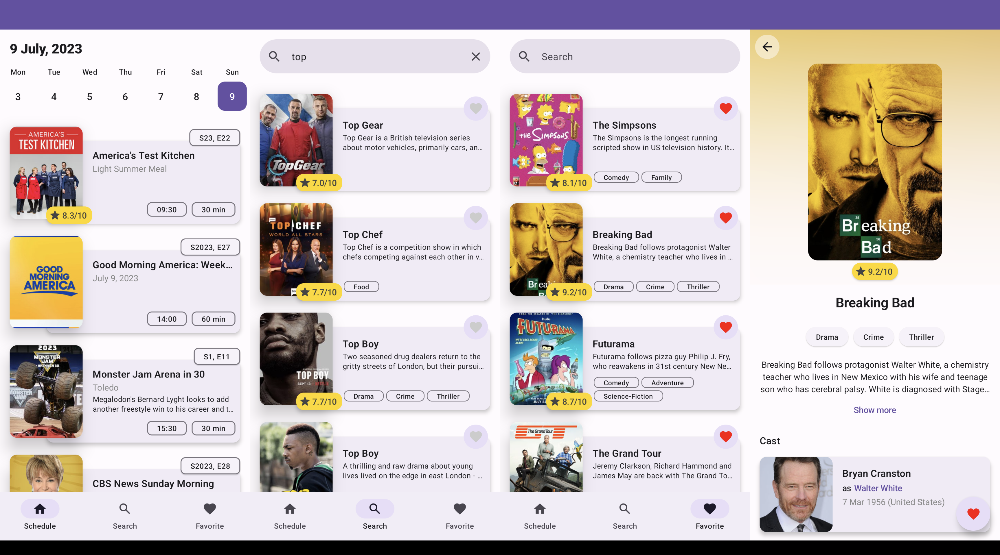
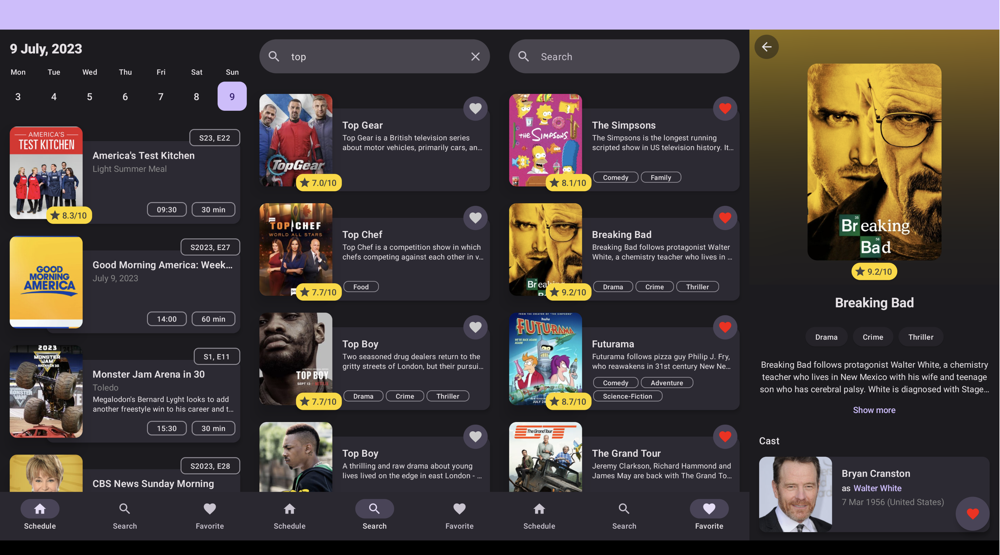

# tv-schedule
## Simple showcase Android application
#### The release APK could be found here: [tv-schedule](apks)
### Main information
* Architecture: Clean + MVI
* UI: [JetpackCompose](https://developer.android.com/jetpack/compose)
* DI: [DaggerHilt](https://dagger.dev/hilt/)
* Concurrency: [Kotlin coroutines, Flow](https://developer.android.com/kotlin/coroutines)
* HTTP client: [Retrofit2](https://square.github.io/retrofit/)
* DB: [Room](https://developer.android.com/training/data-storage/room)
* Data serialization: [Kotlin serialization](https://github.com/Kotlin/kotlinx.serialization)
* CI/CD: [GitHub actions](https://github.com/features/actions)
* Calendar: [JCalendar](https://github.com/andrewafanasenko/JCalendar) (own implementation)
* Animations: [Lottie](https://github.com/airbnb/lottie/blob/master/android-compose.md)
* Image loading: [Coil](https://coil-kt.github.io/coil/compose/)

### Screenshots
* Light theme

* Dark theme

